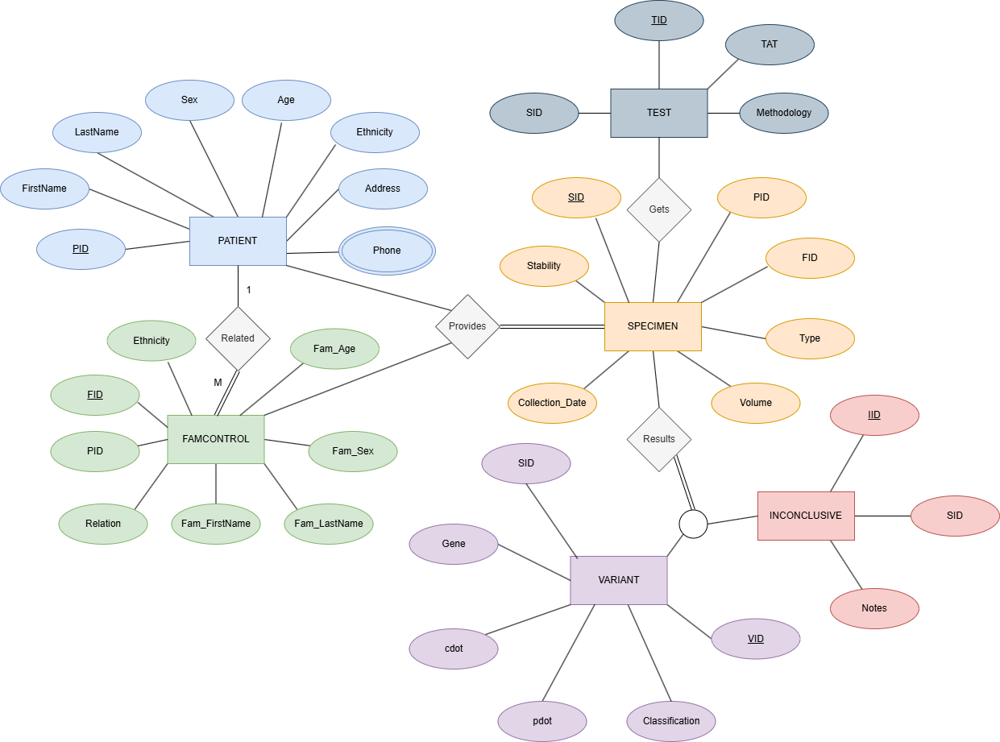
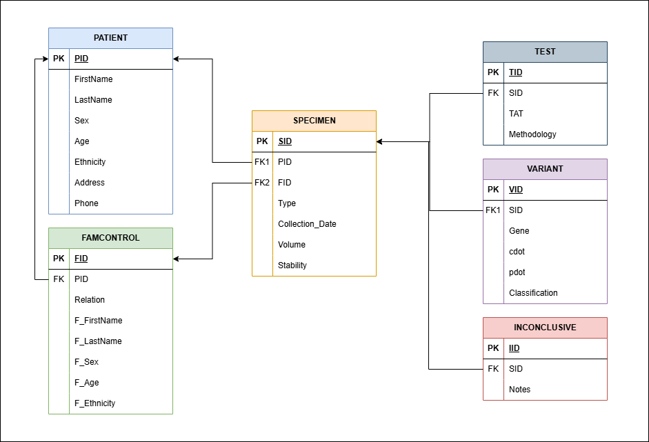

# Clinical Database for Genetic Testing Center

## Background

A genetic testing company specializes in analyzing an individual's DNA to provide insights into various aspects of their genetic makeup. The primary goal is to uncover pathogenic variants that cause disease phenotypes. This process can be streamlined by comparing the patient's DNA against a family member’s and looking at the differences between their DNA sequence. Variants that are found in both the patient and the familial control’s sequence can be eliminated, while variants that are only in the patients sequence can be further investigated for pathogenicity. 

Genetic testing can reveal potential health risks based on variations in specific genes. This information may include predispositions to certain diseases or conditions, allowing individuals to make informed decisions about their lifestyle, healthcare, and preventive measures. In addition to this, genetic testing helps individuals identify whether they carry specific genetic mutations associated with hereditary conditions. This information is particularly relevant for family planning, as it can indicate the risk of passing on certain genetic disorders to future generations.

Patients are referred to this company through genetics counselors to ensure they are receiving the proper test for their phenotype. Genetic counselors provide support, address concerns, and help interpret the implications of genetic information. The specific type of genetic testing is chosen based on specific interests and concerns, whether related to ancestry, health, or other factors. 

This company performs DNA extraction from whole blood, bone marrow, and saliva samples using Qiagen DNA extraction kits. DNA libraries are prepared for sequencing using Illumina library prep kits and sequenced on Illumina Next-Generation Sequencers.


---

## Clinical Database Requirements

Patient and family information will be recorded when they are referred from their clinician or genetic counselor. Patient demographic data (first name, last name, sex, age, ethnicity, address, and phone number) will be associated with a unique patient ID (PID). Relatives that participate as familial controls will have unique family IDs (FID) for their information (first name, last name, sex, age, ethnicity). Patients can have multiple familial controls but each familial control will only be associated with one patient. 

Each patient and familial control will provide a specimen for genetic testing. Specimen data (specimen type, collection date, volume, stability) will have a unique specimen ID (SID). All specimens will be associated with a patient, but will only be associated with a familial control ID if it came from a family member and not a patient.

Once specimens are provided, they will have tests ordered under unique test IDs (TID). Test data (turn-around time, and methodology) will be tied to specimen IDs. In addition to this, each specimen will be provided with a result once testing is finished. Results that identify variants are tied to unique variant IDs (VID) which are associated with variant data (gene, c.dot, p.dot, and classification). Results that are inconclusive will have unique inconclusive IDs (IID) which are associated with the corresponding inconclusive result data (notes).

---

## Conceptual Data Model



### Figure 1. Conceptual data model for genetic testing company. Entities are represented as rectangles, relations as diamonds, and attributes as ovals. Identify attributes are underlined and multivalued attributes are in double ovals.One-to-many cardinality is represented by a 1 and M between relationship entities. A double line connected to a circle with single line branches represents total specialization; ie: a specimen's result can have either a variant or be inconclusive but not both.



### Figure 2. Logical Database Design for genetic testing company. Entities are represented as relation tables. Foreign keys are labeled as FK and primary keys are labeled as PK.

---

## Database Design Language (DDL) Implementation

### Patient Table
```sql
CREATE TABLE [PATIENT](
  [PID] varchar(15) NOT NULL, 
  [FirstName] varchar(15), 
  [LastName] varchar(25), 
  [Sex] varchar(6), 
  [Age] integer, 
  [Ethnicity] varchar(25), 
  [Address] varchar(50), 
  [Phone] integer, 
  CONSTRAINT [PATIENT_PK] PRIMARY KEY([PID])
);
